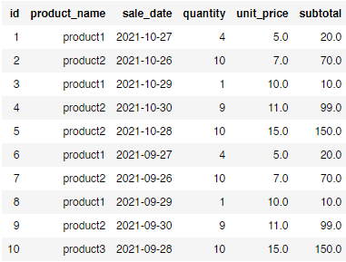
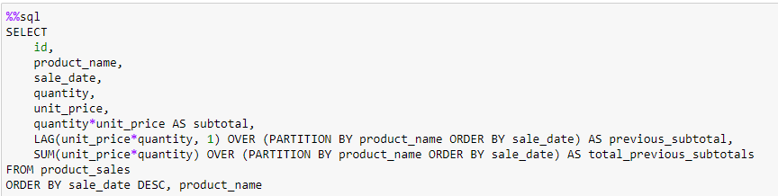
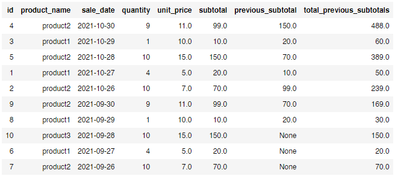
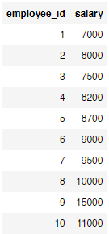
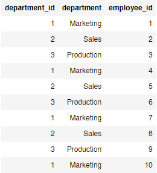
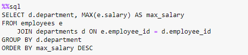
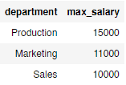

# SQL Exercises

In this project, I practice my analytical SQL skills by solving various questions.

## First Question

> Q1: Suppose that we have a table that contains products, and their sales subtotals. We want to display this table, with the total previous subtotals of each product.

I answered this question in a practical way, by creating a table in a local Postgres database, as follows:

then used the `LAG` function to get the previous subtotal, and the `SUM` fucntion to get the total previous subtotals, for each product, as follows:

Which got me the results we want:

## Second Question

> Q2: Suppose that we have two tables:
> * The first table contains employees and their salaries.
> * The second table contains the company departments and the employees of each department.  

>Now, we want to know which departments have the highest salaries in the company.

I answered this question in a practical way as well, by creating two tables in a local Postgres database, as follows:

### First Table:

### Second Table:

then joined the two tables to answer this question, as follows:

Which got us the maximum salary in each department in a descending order:

## About The Author

* Author: Mohamed Abdel-Gawad Ibrahim
* Contact: muhammadabdelgawwad@gmail.com
* Phone: +201069052620 | +201147821232
